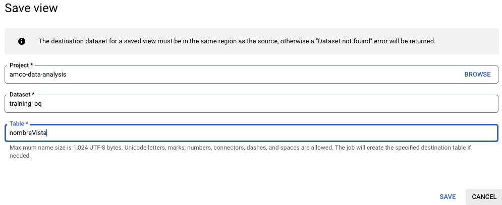
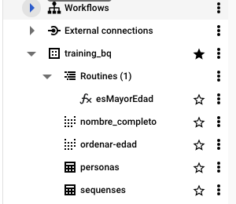
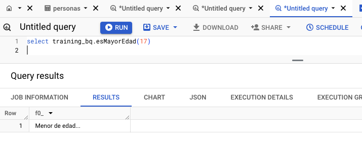
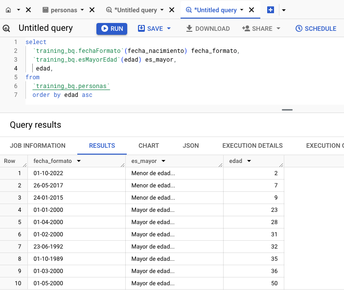

# BigQuery Training
**Description**

###### This issue focuses on training in Google BigQuery you will learn key concepts, execute queries, schedule queries, work with views, and perform CRUD operations on tables. The training will involve using both the BigQuery web interface and the Python SDK. Additionally, you will gain an understanding of GCP Service Accounts and how to use them to interact with BigQuery programmatically. BigQuery's ability to handle nested and repeated data will also be covered.

**Tasks:**

***1. Understand BigQuery Concepts***
* Research key concepts in BigQuery, including***

    * What is BigQuery and how it differs from traditional databases.

    * Concepts of datasets, tables, schema and projects in BigQuery.

**Task:**
* Write a summary of the key BigQuery concepts and explain how datasets, tables, and projects are organized.
* >"BigQuery as I understand it, isa a DB manager  aimed at high volumes of data and with features  that range from serverless, being able to  execute SQL queries, all managed from google cloud, to versatility to simplify data reporting." 

* > "Project->Datasets->(Schema)->Tables:
    >- **Projects:** Are the most high level en BigQuery, datasets and tables are living always in a porject. ("`projectName`")
    >- **Datasets:** Are containers of tables and views related each and others. (`projectName.datasetName`)
    >- **Tables:** This are where our data will live in the project at rows and columns forms. (`projectName.datasetName.tableName`)
    >- **Schemas:** Refers to the definition of the structure of our table, specifies columns names, the type of data each column contains, and other details such as whether a column can have null values ​​or whether it is repeated. (`projectName.datasetName.(schema)tableName`) 

| **TASK**    | :white_check_mark: |
| :---        |               ---: |
--- 

***2. Perform Queries in BigQuery***
* Learn how to write and execute SQL queries in BigQuery.

**Task:**
* Use the BigQuery web interface to execute the following types of queries:

    * Basic SELECT queries.
        > `SELECT * FROM training_bq.personas`
    * Filtering with WHERE.
        > `SELECT * FROM training_bq.personas WHERE edad > 25`
    * Aggregation with GROUP BY and HAVING.
        > `SELECT  country, state_abbreviation, airport_use, COUNT(*) AS Vuelos FROM 'bigquery-public-data.faa.us_airports' WHERE country = 'United States' GROUP BY country, airport_use, state_abbreviation ORDER BY state_abbreviation`
    * Joins between tables.
        > `SELECT personas.nombre, personas.apellido equipos.equipo FROM training_bq.personas as personas JOIN training_bq.equipos as equipos ON personas.equipo_id = equipos.id`
    * Queries on **nested and repeated fields.**
        - Repeated info, on Repeated mode column:
        > `select teams from 'amco-data-analysis.training_bq.personas', unnest(equipos) teams where  id = 1`
        - Nested info, on Record type column with some parents info attached:
        > `SELECT direccion.ciudad from amco-data-analysis training_bq.personas WHERE direccion.cp = 8992`

| **TASK**    | :white_check_mark: |
| :---        |               ---: |
---

***3. Scheduled Queries*** :warning:
* Research how to create and manage scheduled queries in BigQuery.
    > If we need to run a query at specific time or interval we can create a scheduled query and save the results in a specific table for that query.
* Learn how to automate recurring queries to run at specific intervals.
    > 1 Name of the query
    > 2 How often and the time when the query will run and when it start and end.
    > 3 Set the location of the table where the query will bi saved
    > 4 Choose if the new query results will be overwrite the existing previous query results or if just add to existing resurlts.
    

**Task:**
* Create a scheduled query that runs a report (e.g., total sales by region) every week using the BigQuery web interface.
    > - For the moment, I dont have permissions to create a scheduled querys, This is because with that permission you would have access to various information not yet necessary for the tasks in this issue.

| **TASK**    | :white_check_mark: |
| :---        |               ---: |
---

***4. Working with Views***
* Learn how to create views in BigQuery to save reusable query results.
    - There is two differents way to create a view: By code adding the lines `CREATE VIEW 'project.dataset.nameVista' AS <fallowing by the entire code of the view>` or simply saving the code like a view, and adding in the right inputs the names of the project, dataset and in table, the name of the view:
    
* Understand the difference between a regular table and a view.
    - With a consult of a regular table we read directly of memory de data, meanwhile with views the result of the query are just logical and we dont touch the memory itself

**Task:**
* Create views based on existing queries to summarize or filter data.
    - We create a previous view that concat the name and apellido fields, and then create this view with a select * from an existent view and join with the table itself for order asc with the value edad:
    >`SELECT nombre_completo, edad FROM 'amco-data-analysis.training_bq.nombre_completo' as vista join 'amco-data-analysis.training_bq.personas' as p on vista.id = p.id ORDER BY edad ASC`
* Document how views can be used in your BigQuery project
    - The views are a string tool to make querys faster, secure and without touching the data where they live, for use a some code, no matter how much lines they had with no need to retype every time.

| **TASK**    | :white_check_mark: |
| :---        |               ---: |
---

***5. User-Defined Functions (UDFs)***
* Learn how to create user-defined functions (UDFs) in BigQuery using JavaScript or SQL.

**Task:**

* Create a UDF to manipulate or transform data (e.g., formatting dates, custom calculations).
    >`CREATE FUNCTION`
`'amco-data-analysis.training_bq.esMayorEdad'(x INT64)`
`RETURNS STRING`
`AS (`
  `CASE`
    `WHEN x > 17 THEN "Mayor de edad..."`
    `ELSE "Menor de edad..."`
  `END`
`);`
    - And the function was visible on the "Viewing resources":
    

* Implement the UDF through in the web interface 
    - We just call the function passing the parameterv in any query we want:
    
* Document the use cases for UDFs in BigQuery.
    - We can call any functions we want and adding a FROM after the the function call, we can pass any field we need to proced.
    

**Example UDF query in BigQuery:**

>`CREATE OR REPLACE FUNCTION project.dataset.format_date(date_string STRING)
>RETURNS STRING
>LANGUAGE js AS """
>return new Date(date_string).toISOString().split('T')[0];
"""`

| **TASK**    | :white_check_mark: |
| :---        |               ---: |
---

