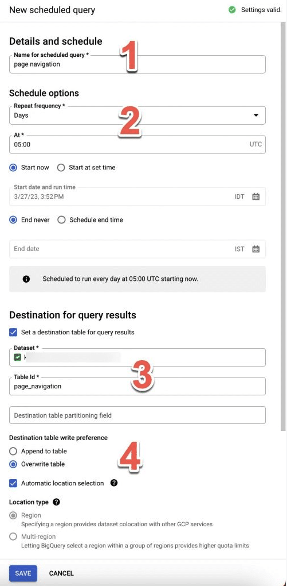

# BigQuery Training
**Description**

###### This issue focuses on training in Google BigQuery you will learn key concepts, execute queries, schedule queries, work with views, and perform CRUD operations on tables. The training will involve using both the BigQuery web interface and the Python SDK. Additionally, you will gain an understanding of GCP Service Accounts and how to use them to interact with BigQuery programmatically. BigQuery's ability to handle nested and repeated data will also be covered.

**Tasks:**

***1. Understand BigQuery Concepts***
* Research key concepts in BigQuery, including***

    * What is BigQuery and how it differs from traditional databases.

    * Concepts of datasets, tables, and projects in BigQuery.

**Task:**
* Write a summary of the key BigQuery concepts and explain how datasets, tables, and projects are organized.
* >"BigQuery as I understand it, isa a DB manager  aimed at high volumes of data and with features  that range from serverless, being able to  execute SQL queries, all managed from google cloud, to versatility to simplify data reporting." 

* > "Project->Datasets->Tables:
A project can contain one or any datasets wich could be named as the databases of a MySQL, while the tables are part of the datasets and this is where the data will be stored.

| **TASK**    | :white_check_mark: |
| :---        |               ---: |
--- 

***2. Perform Queries in BigQuery***
* Learn how to write and execute SQL queries in BigQuery.

**Task:**
* Use the BigQuery web interface to execute the following types of queries:

    * Basic SELECT queries.
        > `SELECT * FROM training_bq.personas`
    * Filtering with WHERE.
        > `SELECT * FROM training_bq.personas WHERE edad > 25`
    * Aggregation with GROUP BY and HAVING.
        > `SELECT  country, state_abbreviation, airport_use, COUNT(*) AS Vuelos FROM 'bigquery-public-data.faa.us_airports' WHERE country = 'United States' GROUP BY country, airport_use, state_abbreviation ORDER BY state_abbreviation`
    * Joins between tables.
        > `SELECT personas.nombre, personas.apellido equipos.equipo FROM training_bq.personas as personas JOIN training_bq.equipos as equipos ON personas.equipo_id = equipos.id`
    * Queries on **nested and repeated fields.**
        - Repeated info, on Repeated mode column:
        > `select teams from 'amco-data-analysis.training_bq.personas', unnest(equipos) teams where  id = 1`
        - Nested info, on Record type column with some parents info attached:
        > `SELECT direccion.ciudad from amco-data-analysis training_bq.personas WHERE direccion.cp = 8992`

| **TASK**    | :white_check_mark: |
| :---        |               ---: |
---

***3. Scheduled Queries*** :warning:
* Research how to create and manage scheduled queries in BigQuery.
    > If we need to run a query at specific time or interval we can create a scheduled query and save the results in a specific table for that query.
* Learn how to automate recurring queries to run at specific intervals.
    > 1 Name of the query
    > 2 How often and the time when the query will run and when it start and end.
    > 3 Set the location of the table where the query will bi saved
    > 4 Choose if the new query results will be overwrite the existing previous query results or if just add to existing resurlts.
    

**Task:**
* Create a scheduled query that runs a report (e.g., total sales by region) every week using the BigQuery web interface.
    > - For the moment, I dont have permissions to create a scheduled querys, This is because with that permission you would have access to various information not yet necessary for the tasks in this issue.

| **TASK**    | :white_check_mark: |
| :---        |               ---: |
---